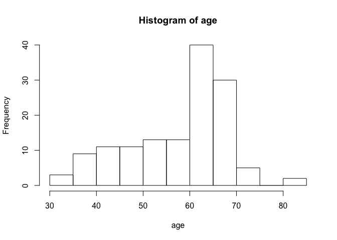
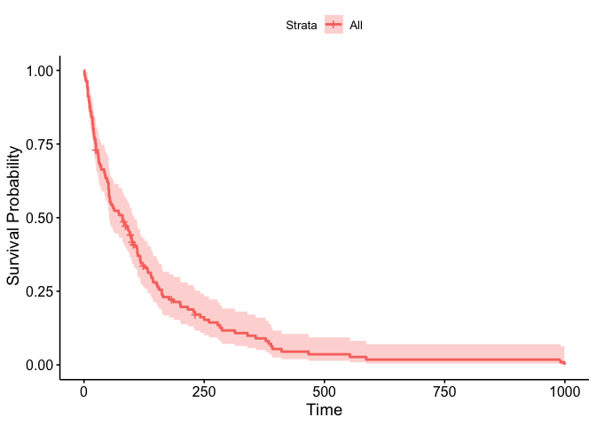
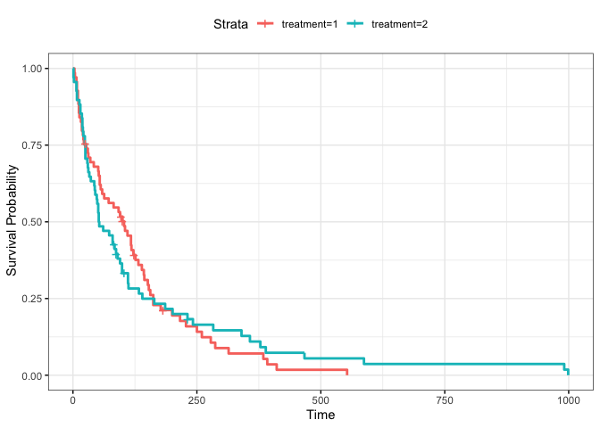

SurvivalAnalysis
================
Harika Gillela
5/23/2020

``` r
setwd("/Users/harikagillela/OneDrive - University of South Florida/SDM-git/Survival-Analysis")
#library(textreadr)
df = read.table("LungCancer.rtf", header = FALSE,skip = 24)
dim(df)
```

    ## [1] 137   8

``` r
names(df)<-c("treatment","celltype","survival_days","status","kscore","months","age","chemo_prior")
df$chemo_prior = as.integer(gsub("[\\},]", "", df$chemo_prior))
df$celltype = factor(df$celltype)
df$celltype = relevel(df$celltype, "1")
str(df)
```

    ## 'data.frame':    137 obs. of  8 variables:
    ##  $ treatment    : int  1 1 1 1 1 1 1 1 1 1 ...
    ##  $ celltype     : Factor w/ 4 levels "1","2","3","4": 1 1 1 1 1 1 1 1 1 1 ...
    ##  $ survival_days: int  72 411 228 126 118 10 82 110 314 100 ...
    ##  $ status       : int  1 1 1 1 1 1 1 1 1 0 ...
    ##  $ kscore       : int  60 70 60 60 70 20 40 80 50 70 ...
    ##  $ months       : int  7 5 3 9 11 5 10 29 18 6 ...
    ##  $ age          : int  69 64 38 63 65 49 69 68 43 70 ...
    ##  $ chemo_prior  : int  0 10 0 10 10 0 10 0 0 0 ...

``` r
attach(df)
```

## Descriptive Statistics

``` r
table(treatment)
```

    ## treatment
    ##  1  2 
    ## 69 68

``` r
table(status)
```

    ## status
    ##   0   1 
    ##   9 128

``` r
summary(survival_days)
```

    ##    Min. 1st Qu.  Median    Mean 3rd Qu.    Max. 
    ##     1.0    25.0    80.0   121.6   144.0   999.0

``` r
hist(age)
```

<!-- -->

``` r
table(survival_days)
```

    ## survival_days
    ##   1   2   3   4   7   8  10  11  12  13  15  16  18  19  20  21  22  24 
    ##   2   1   1   1   3   4   2   1   2   2   2   1   3   2   2   2   1   2 
    ##  25  27  29  30  31  33  35  36  42  43  44  45  48  49  51  52  53  54 
    ##   4   1   1   2   2   1   1   1   1   1   1   1   1   1   3   3   1   2 
    ##  56  59  61  63  72  73  80  82  83  84  87  90  92  95  97  99 100 103 
    ##   1   1   1   1   1   1   2   1   1   1   2   1   1   2   1   2   2   2 
    ## 105 110 111 112 117 118 122 123 126 132 133 139 140 143 144 151 153 156 
    ##   1   1   2   1   2   1   1   1   1   1   1   1   1   1   1   1   1   1 
    ## 162 164 177 182 186 200 201 216 228 231 242 250 260 278 283 287 314 340 
    ##   2   1   1   1   1   1   1   1   1   2   1   1   1   1   1   1   1   1 
    ## 357 378 384 389 392 411 467 553 587 991 999 
    ##   1   1   1   1   1   1   1   1   1   1   1

``` r
table(celltype)
```

    ## celltype
    ##  1  2  3  4 
    ## 35 48 27 27

## Kaplan-Meier

``` r
library(survival)
library(survminer)
```

    ## Loading required package: ggplot2

    ## Loading required package: ggpubr

    ## Loading required package: magrittr

``` r
# event - status, survival_days -- time 
km1 <- survfit(Surv(survival_days,status)~1)
ggsurvplot(km1, xlab = "Time", ylab = " Survival Probability", data = df)
```

<!-- -->

# 1\. Kaplan-Meier survival graphs for patients with the test vs standard treatment.

``` r
km2 <- survfit(Surv(survival_days, status) ~ treatment)
ggsurvplot(km2, xlab = "Time", ylab = " Survival Probability", data = df, ggtheme = theme_bw())
```

<!-- -->

1.  The patients with test treatment type can survive for long time
    compared to those of standard treatment but the survival probability
    is very low (0.05 from time period 500 – 1000).
2.  The survival probability for the standard treatment patients is high
    initially (till 150 days approx.) but later the probability is
    reduced when compared to the test treatment.
3.  The graph has ended at time period 553 as we don’t have any standard
    treatment patient survived beyond that time period.

**Lets check the survival probablity at certain period of time from the
model results**

``` r
summary(km2, times = 365.25)
```

    ## Call: survfit(formula = Surv(survival_days, status) ~ treatment)
    ## 
    ##                 treatment=1 
    ##         time       n.risk      n.event     survival      std.err 
    ##     365.2500       4.0000      60.0000       0.0708       0.0336 
    ## lower 95% CI upper 95% CI 
    ##       0.0279       0.1795 
    ## 
    ##                 treatment=2 
    ##         time       n.risk      n.event     survival      std.err 
    ##     365.2500       6.0000      58.0000       0.1098       0.0407 
    ## lower 95% CI upper 95% CI 
    ##       0.0530       0.2272

``` r
summary(km2,times = 183)
```

    ## Call: survfit(formula = Surv(survival_days, status) ~ treatment)
    ## 
    ##                 treatment=1 
    ##         time       n.risk      n.event     survival      std.err 
    ##     183.0000      12.0000      52.0000       0.2124       0.0514 
    ## lower 95% CI upper 95% CI 
    ##       0.1322       0.3414 
    ## 
    ##                 treatment=2 
    ##         time       n.risk      n.event     survival      std.err 
    ##     183.0000      14.0000      51.0000       0.2329       0.0529 
    ## lower 95% CI upper 95% CI 
    ##       0.1492       0.3634

**Survival Probability** Standard Treatment: 1 year (365 days) 0.0708, 6
months (183 days) 0.2124 Test Treatment ‘2’: 1 year (365 days) 0.1098, 6
months (183 days)
0.2329

## Semi Parametric Models : Cox Proportional Hazrad Model

``` r
cox <- coxph(Surv(survival_days, status) ~ celltype + treatment + age + chemo_prior +kscore + months, method = "breslow")
summary(cox)
```

    ## Call:
    ## coxph(formula = Surv(survival_days, status) ~ celltype + treatment + 
    ##     age + chemo_prior + kscore + months, method = "breslow")
    ## 
    ##   n= 137, number of events= 128 
    ## 
    ##                  coef exp(coef)  se(coef)      z Pr(>|z|)    
    ## celltype2    0.856487  2.354873  0.275190  3.112  0.00186 ** 
    ## celltype3    1.188299  3.281496  0.300763  3.951 7.78e-05 ***
    ## celltype4    0.399628  1.491270  0.282663  1.414  0.15742    
    ## treatment    0.289936  1.336342  0.207210  1.399  0.16174    
    ## age         -0.008549  0.991487  0.009304 -0.919  0.35816    
    ## chemo_prior  0.007233  1.007259  0.023213  0.312  0.75536    
    ## kscore      -0.032622  0.967905  0.005505 -5.926 3.11e-09 ***
    ## months      -0.000092  0.999908  0.009125 -0.010  0.99196    
    ## ---
    ## Signif. codes:  0 '***' 0.001 '**' 0.01 '*' 0.05 '.' 0.1 ' ' 1
    ## 
    ##             exp(coef) exp(-coef) lower .95 upper .95
    ## celltype2      2.3549     0.4247    1.3732    4.0384
    ## celltype3      3.2815     0.3047    1.8200    5.9167
    ## celltype4      1.4913     0.6706    0.8569    2.5951
    ## treatment      1.3363     0.7483    0.8903    2.0058
    ## age            0.9915     1.0086    0.9736    1.0097
    ## chemo_prior    1.0073     0.9928    0.9625    1.0541
    ## kscore         0.9679     1.0332    0.9575    0.9784
    ## months         0.9999     1.0001    0.9822    1.0180
    ## 
    ## Concordance= 0.736  (se = 0.021 )
    ## Likelihood ratio test= 61.41  on 8 df,   p=2e-10
    ## Wald test            = 61.65  on 8 df,   p=2e-10
    ## Score (logrank) test = 65.92  on 8 df,   p=3e-11

**Cox proportional Hazard Model** \* The test treatment indicates the
higher risk of death when compared the standard treatment. The test
treatment increases the hazard rate by 33%.. This model suggests that
standard treatment can increase the survival rate when compared to the
test treatment. \* Age, Months from Diagnosis will reduce the hazard
rate by 1% which is negligible. \* Comparing with the cell type 1, the
cell type 2 ,3 and 4 patients have higher risk of death. Among all types
of cells, patients with cell type 3 have the highest risk to the death.
The cell type 3 increases the hazard rate by 228%. The cell type 2 and 4
increases the hazard rates by 135% and 49% respectively. \* Having prior
chemotherapy will increase the risk of death. This will increase the
hazard rate by 7%. \* Patients with better Karnofsky score will have low
risk of death or more survival time. This will reduce the hazard rate by
4%.

## Exponential, Weibull, and log-logistic parametric model coefficients

``` r
exp <- survreg(Surv(survival_days, status) ~ celltype + treatment + age + chemo_prior + kscore+ months, dist="exponential")


weibull <- survreg(Surv(survival_days, status) ~ celltype + treatment + age + chemo_prior + kscore+ months, dist="weibull")


loglogistic <- survreg(Surv(survival_days, status) ~ celltype + treatment + age + chemo_prior + kscore + months, dist="loglogistic")


library(stargazer)
```

    ## 
    ## Please cite as:

    ##  Hlavac, Marek (2018). stargazer: Well-Formatted Regression and Summary Statistics Tables.

    ##  R package version 5.2.2. https://CRAN.R-project.org/package=stargazer

``` r
stargazer(cox, exp, weibull, loglogistic, type="text")
```

    ## 
    ## ==================================================================================
    ##                                           Dependent variable:                     
    ##                      -------------------------------------------------------------
    ##                                              survival_days                        
    ##                             Cox         exponential  Weibull  survreg: loglogistic
    ##                        prop. hazards                                              
    ##                             (1)             (2)        (3)            (4)         
    ## ----------------------------------------------------------------------------------
    ## celltype2                 0.856***       -0.820***  -0.826***      -0.708***      
    ##                           (0.275)         (0.262)    (0.246)        (0.249)       
    ##                                                                                   
    ## celltype3                 1.188***       -1.113***  -1.133***      -0.743***      
    ##                           (0.301)         (0.276)    (0.258)        (0.272)       
    ##                                                                                   
    ## celltype4                  0.400          -0.377     -0.398          0.017        
    ##                           (0.283)         (0.273)    (0.255)        (0.270)       
    ##                                                                                   
    ## treatment                  0.290          -0.220     -0.229          -0.088       
    ##                           (0.207)         (0.199)    (0.187)        (0.179)       
    ##                                                                                   
    ## age                        -0.009          0.006      0.006          0.009        
    ##                           (0.009)         (0.009)    (0.009)        (0.009)       
    ##                                                                                   
    ## chemo_prior                0.007          -0.005     -0.004          -0.010       
    ##                           (0.023)         (0.023)    (0.021)        (0.021)       
    ##                                                                                   
    ## kscore                   -0.033***       0.031***   0.030***        0.036***      
    ##                           (0.006)         (0.005)    (0.005)        (0.004)       
    ##                                                                                   
    ## months                    -0.0001         -0.0003    -0.0005         0.002        
    ##                           (0.009)         (0.009)    (0.008)        (0.010)       
    ##                                                                                   
    ## Constant                                 3.408***   3.491***        2.113***      
    ##                                           (0.734)    (0.691)        (0.713)       
    ##                                                                                   
    ## ----------------------------------------------------------------------------------
    ## Observations                137             137        137            137         
    ## R2                         0.361                                                  
    ## Max. Possible R2           0.999                                                  
    ## Log Likelihood            -475.179       -716.159   -715.551        -711.943      
    ## chi2 (df = 8)                            70.124***  65.080***      76.646***      
    ## Wald Test            61.650*** (df = 8)                                           
    ## LR Test              61.409*** (df = 8)                                           
    ## Score (Logrank) Test 65.917*** (df = 8)                                           
    ## ==================================================================================
    ## Note:                                                  *p<0.1; **p<0.05; ***p<0.01

**Interpretations** **Parametric Model: Weibull Model**

  - Increase in patient’s age will reduce the risk to death by factor of
    1, exp(0.006)
  - Months from Diagnosis will increase the risk of death by factor
    exp(-0.0005) = 0.99
  - The cell types 2, 3 and 4 increase the risk of death when compared
    to cell type 1. The cell type 2 increases the risk of death by 0.43,
    the cell type 3 increases the death rate by exp(-1.133) = 0.32 and
    the cell type 4 increases the risk of death by factor exp(-0.398) =
    0.67. This tell us that the survival rate is high in case of
    patients with cancer with cell type 1.
  - Prior Chemotherapy will increase the risk to the death by factor
    0.99(Weibull and Log logistic). Patients without prior chemotherapy
    will have 0.99 times better survival rate than the patients with
    prior chemotherapy.
  - The Karnofsky score will reduce the risk of death by factor
    exp(0.030068) = 1.030(Weibull and Log logistic) .
  - The test treatment type will accelerate the death of the patient by
    a factor of exp(-0.228) = 1.256”Weibull”. Standard treatment
    patients will have 1.256 times better survival than the test
    treatment patients.

**Parametric Model: Loglogistic Models**

  - Increase in patient’s age will reduce the risk to death by factor of
    1, exp(0.009)
  - Months from Diagnosis will increase the risk of death by factor
    exp(-0.0005) = 0.99
  - The cell types 2, 3 and 4 increase the risk of death when compared
    to cell type 1. The cell type 2 increases the risk of death by 0.49,
    the cell type 3 increases the death rate by exp(-0.743) = 0.47 and
    the cell type 4 reduces the risk of death by factor exp(0.017) =
    1.017.
  - Prior Chemotherapy will increase the risk to the death by factor
    0.99(Weibull and Log logistic). Patients without prior chemotherapy
    will have 0.99 times better survival rate than the patients with
    prior chemotherapy.
  - The Karnofsky score will reduce the risk of death by factor
    exp(0.030068) = 1.030(Weibull and Log logistic) .
  - The test treatment type will accelerate the death of the patient by
    a factor of exp(-0.08846) = 0.91
